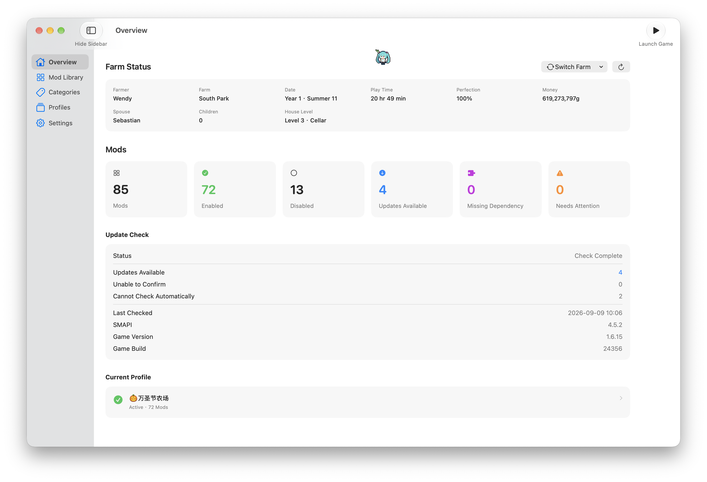
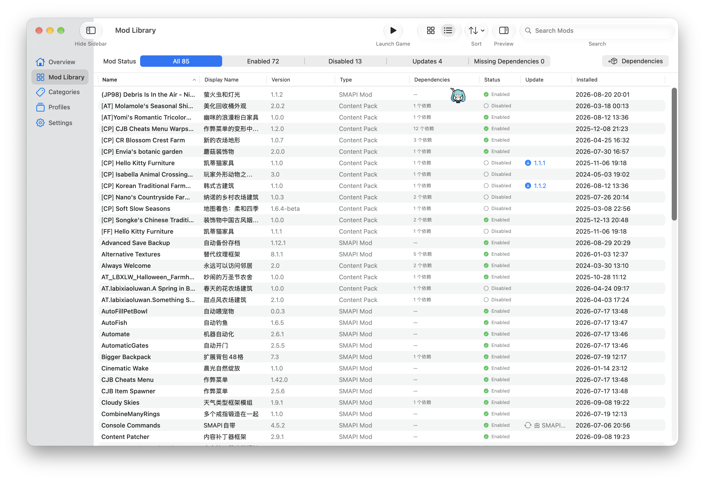
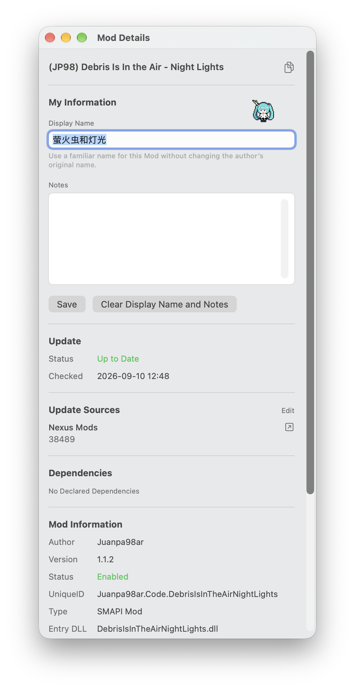
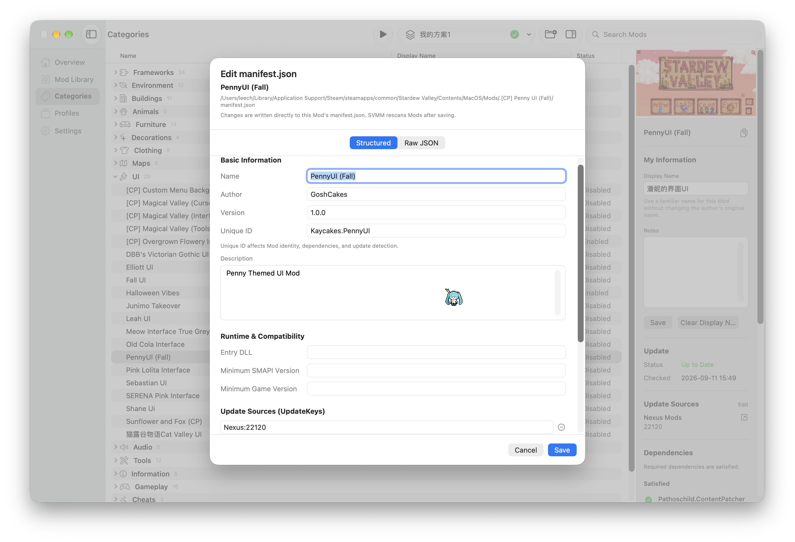
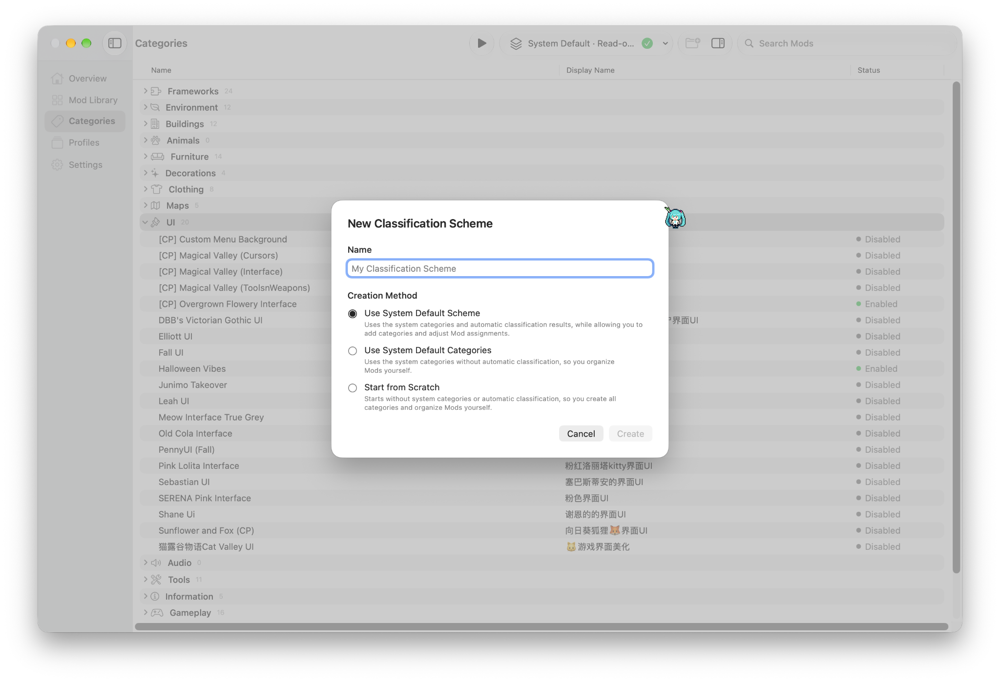
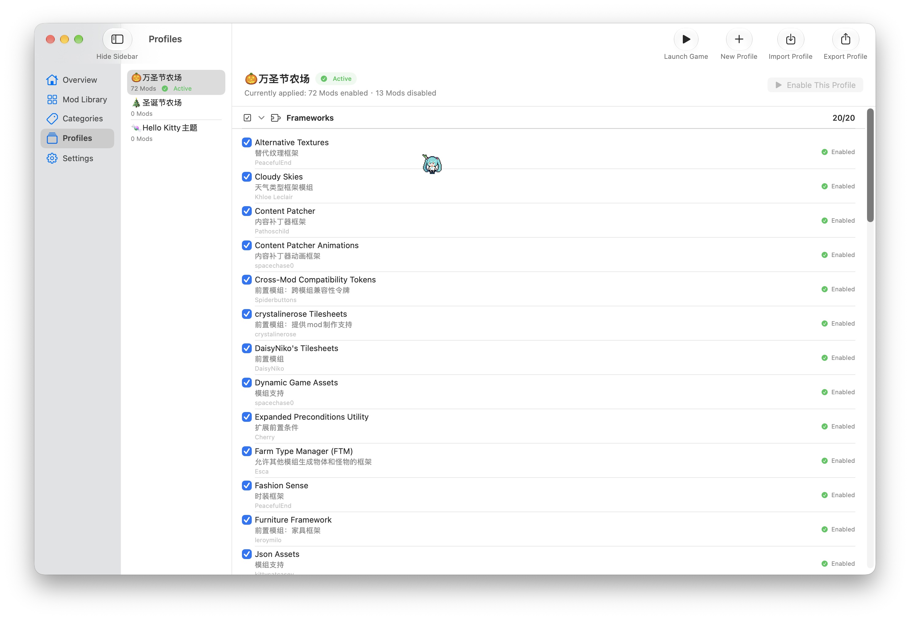
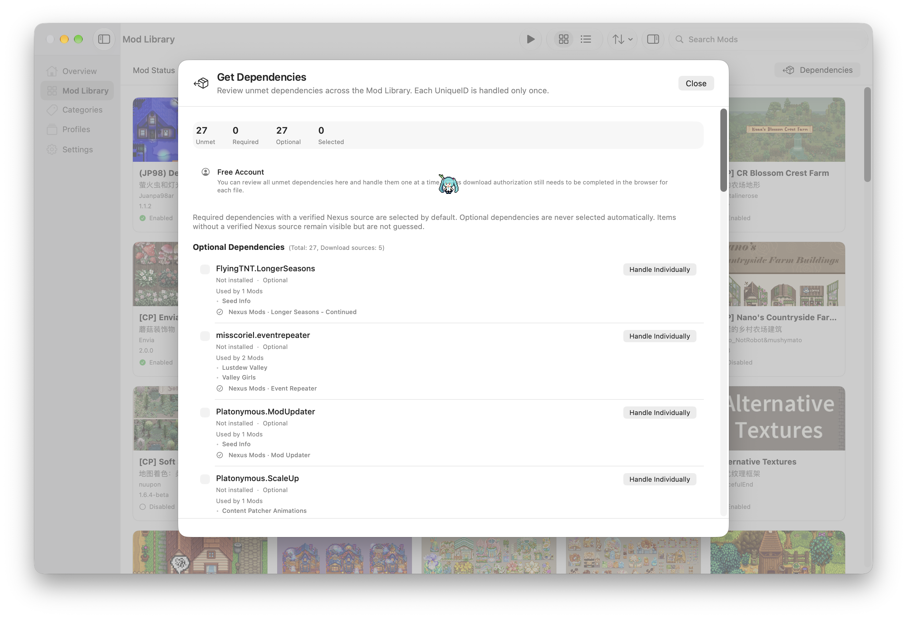
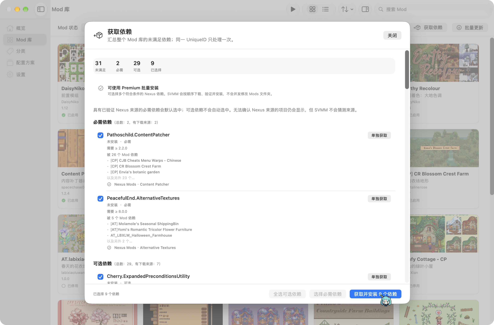
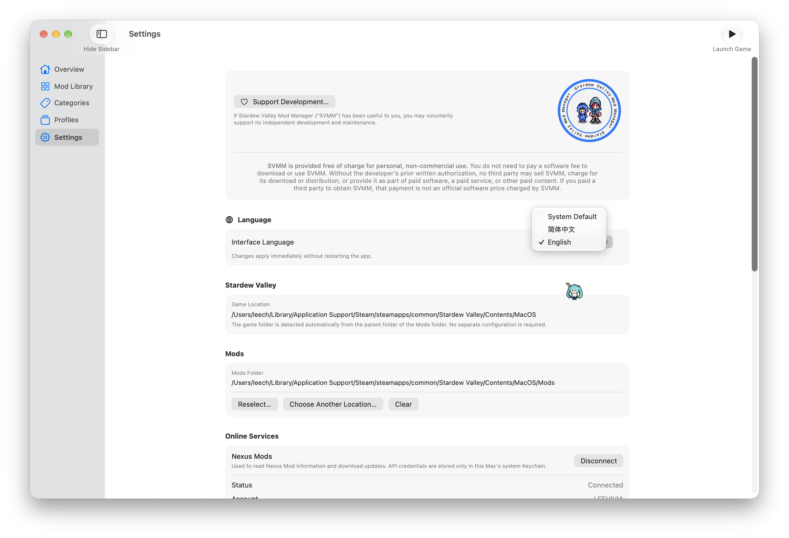
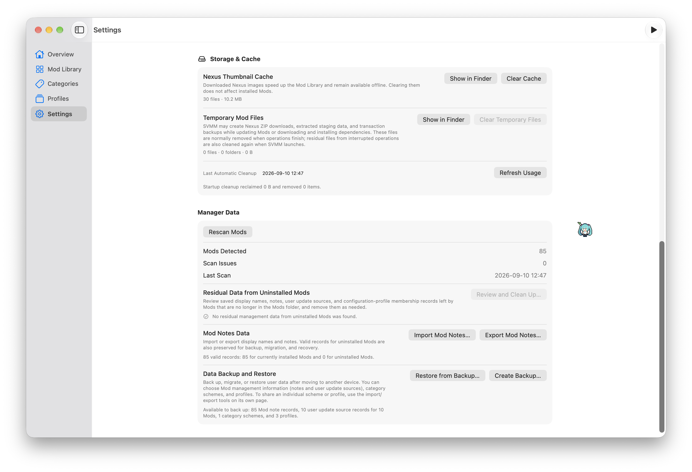

  

<h1 align="center">Stardew Valley Mod Manager</h1>

  <strong>A Chinese-friendly native Stardew Valley Mod manager for macOS.</strong> 
  专用于 macOS 的中文友好型《星露谷物语》Mod 管理器。

  
  
  
  
  
  

  Developer: <strong>Li Wei（李薇）</strong>

  <a href="README.md">简体中文</a>
  ·
  <strong>English</strong>
  ·
  <a href="https://github.com/XModLife/Stardew-Valley-Mod-Manager/releases">Releases</a>
  ·
  <a href="USER-GUIDE.en.md">User Manual</a>
  ·
  <a href="https://github.com/XModLife/Stardew-Valley-Mod-Manager/issues">Issues</a>

---

## Positioning

**Stardew Valley Mod Manager (SVMM)** is a native macOS application for organizing and managing an existing Stardew Valley Mod environment.

**Chinese-friendly support is one of SVMM's core product goals and part of the reason the project exists.** Simplified Chinese UI, Chinese documentation, and the practical needs of Chinese-speaking Stardew Valley players are treated as first-class requirements rather than an afterthought.

The core principle is simple:

> **Manage the Mods you already use instead of creating a second parallel Mod library.**

SVMM focuses on:

- **Chinese-friendly and localization-aware management** — Simplified Chinese is maintained as a primary language, English is also provided, and display-name notes let users describe Mods in language that is easier for them to understand.
- **Native macOS interaction** — Sidebar, Toolbar, menus, windows, keyboard shortcuts, and Finder-like workflows.
- **Local-first data** — core Mod-management data remains on the user's Mac.
- **Practical organization and maintenance** — display-name notes, categories, profiles, Manifest editing, diagnostics, dependency handling, Mod updates, and SVMM software-update workflows in one desktop app.
- **Conservative file transactions** — supported update/dependency operations validate package structure and identity and, where applicable, preserve configuration, create backups, and roll back failures.
- **One cross-version codebase** — the official build targets macOS 15.0 or later while using newer system capabilities conditionally when appropriate.

  

Overview — Mod status, update checks, active profile, and a read-only Stardew Valley save summary.

## Supported Systems & Test Status

The current official build has a **minimum deployment target of macOS 15.0**. SVMM is maintained as one application/codebase rather than separate macOS 15 and macOS 27 editions.

| Environment | Current status |
| --- | --- |
| **macOS 15.0** | Supported and core workflows function. In current VM testing, the Categories page can be less responsive on first entry and during some row-selection interactions than on newer macOS versions. |
| **macOS 26.0** | Tested; primary UI and Categories interactions are smooth. |
| **macOS 27.0** | Tested; primary UI and Categories interactions are smooth. |
| **Apple Silicon** | Native arm64 build tested directly. |
| **Intel / x86_64** | The Release archive contains an x86_64 slice. The x86_64 execution path has been launched under Rosetta 2 on Apple Silicon; a full physical-Intel regression pass has not yet been completed. |

The macOS 15 performance note comes from the current virtual-machine test environment and should not be treated as a universal benchmark for every physical Mac. SVMM does not maintain a separate macOS-15-only interface solely to match animation or interaction latency on newer systems.

See [KNOWN-ISSUES.md](KNOWN-ISSUES.md) for maintained compatibility notes.

## Core Features

### Mod Library — Card View

Designed for quick browsing. Nexus thumbnails are shown when available and status/display-name information helps identify Mods.

  

### Mod Library — List View

Designed for comparing structured information such as original name, display-name note, version, type, dependencies, status, and installation time, with sorting and multi-selection support.

  

### Display-name Notes — Localize Your Own Mod Library

Many Stardew Valley Mods use long project names, abbreviations, or names in a language that may not be convenient for every user. SVMM lets you add a **display-name note** while keeping the author's original Mod identity intact.

Display-name notes:

- are local SVMM management data;
- do not rewrite the author's original name;
- do not modify `manifest.json`;
- can be shown as an additional identifier throughout the UI;
- can be included in note import/export and manager backups.

  

Mod Details — use a familiar display name while keeping the original Mod identity, and review the thumbnail, update source, and dependency status in one place.

### Manifest Editor — Structured `manifest.json` Maintenance

Some third-party Mods ship with metadata that does not fully match the actual release, such as an incorrect version, Unique ID, update source, or dependency declaration. SVMM includes a Manifest Editor that can be opened from the Mod Library or Categories page.

The editor supports:

- `Name`, `Author`, `Version`, `UniqueID`, and `Description`;
- `EntryDll`, `MinimumApiVersion`, and `MinimumGameVersion`;
- `UpdateKeys`;
- adding, removing, and editing `Dependencies`;
- `ContentPackFor`;
- switching between **Structured** and **Raw JSON** modes;
- validation before saving and an automatic Mod rescan after saving;
- structured writes based on the full JSON object so unrelated unknown fields can be preserved where possible.

  

Manifest Editor — edit common fields in Structured mode, or switch to Raw JSON when needed.

Unlike display-name notes or user update-source overrides, the Manifest Editor modifies the Mod's actual `manifest.json`.

### Categories

Categories answer “how should these Mods be organized?” The system default classification is a read-only reference, while user schemes can contain editable assignments and categories.

v1.1.0 adds search to the Categories page and expands high-confidence classification rules for UI, clothing, furniture, decorations, maps, tools, environment, and related patterns. When SVMM cannot classify a Mod reliably, it continues to leave it unrecognized rather than forcing a category.

  

### Profiles

Profiles answer “which Mods should actually be enabled for this setup?” Save and apply enabled/disabled combinations for different saves, play styles, or test environments.

  

### Updates & Nexus Mods

SVMM can combine Mod metadata, SMAPI information, and an optional Nexus Mods connection to check and process supported updates.

A Nexus connection is optional:

- **Free accounts** use supported browser / NXM authorization workflows;
- **Premium accounts** can obtain direct download links where eligible and can use supported batch update workflows;
- when source identity, file selection, or package structure cannot be determined safely, SVMM stops automation rather than guessing.

#### Free Account Update Workflow

  

#### Premium Batch Update

  

### Bundled Multi-Mod Update Packages

Some authors distribute two or more required components together in one ZIP. The current update transaction supports **validated bundled multi-Mod packages**:

- an update ZIP may contain multiple `manifest.json` files;
- the target Mod and companion components must be identified unambiguously;
- already installed companion components can be updated in the same transaction;
- missing components belonging to the validated bundle can be installed as part of that transaction;
- supported configuration files are preserved where applicable;
- if a critical step fails, the transaction attempts to roll back as a whole;
- duplicate identities, target-path conflicts, downgrade risks, or ambiguous package structure stop automatic updating.

### Dependencies

SVMM reads Manifest dependency declarations and distinguishes states such as missing, installed-but-disabled, version-too-low, version-unknown, and duplicate Unique IDs.

#### Free Account Dependency Acquisition

  

#### Premium Batch Dependency Acquisition

  

For dependency ZIPs that contain multiple required components, SVMM likewise uses validated bundled-package rules and a single transaction instead of rejecting the package merely because multiple manifests exist.

### SVMM Software Updates

Starting with SVMM 1.1.0, the application includes its own update-check and download workflow:

- silently check the official GitHub Releases feed at launch;
- show an update notification only when the latest stable Release is **higher than the installed version**;
- remain silent when already up to date, when the remote version is not higher, when the network request fails, or when version information cannot be parsed;
- allow manual checks at any time through **Help → Update Software**;
- download the official Release DMG inside SVMM with visible progress;
- when GitHub provides a SHA-256 asset digest, verify the downloaded file locally and delete it if the digest does not match;
- allow macOS to open the verified disk image;
- **not automatically replace SVMM in `/Applications` or complete installation**;
- keep the GitHub Release page available as a fallback download path.

### Settings

Settings centralize the game/Mods location, interface language, Nexus Mods connection, and local maintenance tools.

  

### Storage, Cache & Manager Backups

SVMM includes local maintenance tools for cache, temporary transaction data, and user-owned management records.

Current controls include:

- inspect and clear **Nexus thumbnail cache**;
- inspect and clear SVMM-managed **temporary Mod/update transaction files**;
- review and remove residual management records left by uninstalled Mods;
- **import/export Mod note data**;
- **create manager-data backups**;
- **restore selected data from backups**.

These controls operate on SVMM-managed cache/metadata; “clear cache” is not interpreted as uninstalling normal Mods.

  

## Interface Languages & Additional Languages

SVMM currently has two developer-maintained and reviewed interface localizations:

1. **Simplified Chinese**
2. **English**
3. **System Default** as a selection mode

“System Default” is **not machine translation**. It asks macOS to choose the best match among localization resources that SVMM actually ships.

SVMM organizes user-facing text through localization resources / String Catalogs, so the architecture **leaves room for additional languages**. However:

- no third official language is currently maintained;
- the developer will not label a language as officially supported if they cannot understand and review it;
- languages outside the developer's own review capability require fluent contributors to help translate, proofread, and review changes over time;
- users interested in helping add another language can open a [GitHub Issue](https://github.com/XModLife/Stardew-Valley-Mod-Manager/issues) or contact **SVMM@npccare.cn** to discuss collaboration.

A restart is required after changing the interface language so SwiftUI content and native macOS menus start in the same localization.

## System Requirements

- **Minimum OS: macOS 15.0**
- **Build architecture: Universal 2 (arm64 + x86_64)**
- Apple Silicon is the primary directly tested hardware platform.
- The x86_64 slice has been launch-tested through Rosetta 2; full physical-Intel regression testing is still pending.
- Stardew Valley for macOS.
- SMAPI is normally required for a modded Stardew Valley environment.
- The user must grant SVMM access to the actual Stardew Valley / `Mods` location in use.

`macOS 15.0+` means 15.0 is the minimum deployment target. Future macOS versions that have not been released or tested cannot be guaranteed in advance.

## Download

Official builds are distributed through **GitHub Releases**:

### [Download the latest official release →](https://github.com/XModLife/Stardew-Valley-Mod-Manager/releases/latest)

Use only distribution channels explicitly identified by the developer. **Do not pay a third party for the SVMM application itself.**

## macOS Security Notice

SVMM is independently distributed through GitHub. The current official GitHub release build is **not signed with an Apple Developer ID certificate and is not Apple-notarized**.

macOS Gatekeeper may therefore warn on first launch that it cannot verify the developer or check the application for malicious software.

Download only from this repository's official Release page and verify the SHA-256 value published with the release. If macOS blocks the first launch after you have verified the source, try opening the app once and then use:

**System Settings → Privacy & Security → Security → Open Anyway**

## First Use

1. Download SVMM from the official GitHub Releases page.
2. Complete the macOS first-launch security flow.
3. Select the Stardew Valley / Mods location you actually use in Settings.
4. Grant SVMM access to scan the Mods folder.
5. Review Overview and Scan Diagnostics before making large changes.
6. Connect Nexus Mods only if you want supported Nexus metadata/download workflows.
7. Keep an independent backup before large updates or major profile changes.

## Current Release Notes & Known Issues

SVMM 1.1.0 is a feature and maintenance update over 1.0.0. See [RELEASE-NOTES-v1.1.0.md](RELEASE-NOTES-v1.1.0.md) and [CHANGELOG.md](CHANGELOG.md) for the full change summary. Confirmed environment-dependent behavior and current boundaries include:

- **Categories is less responsive on macOS 15.0 than on newer systems** in the current VM test environment. First entry and some selection interactions can be slower, while core functionality remains usable and no related data-integrity issue has been identified. macOS 26.0 and 27.0 tests are smooth.
- **The Help menu may briefly change on macOS beta/seed builds** when macOS injects a Feedback Assistant item. This is system behavior and does not affect SVMM management data.
- **Unusual third-party Mod packages can still require manual review.** SVMM validates manifests, Unique IDs, dependencies, and package structure and will not guess when a safe transaction cannot be established.
- **Third-party services can change.** Nexus Mods, SMAPI, GitHub, CDN, or API changes can affect optional online workflows.
- **Physical Intel validation is limited.** The Universal 2 archive contains x86_64, but most testing is performed on Apple Silicon.

See [KNOWN-ISSUES.md](KNOWN-ISSUES.md) for the maintained list.

## Documentation

- [使用手册](USER-GUIDE.md) · [User Manual](USER-GUIDE.en.md)
- [Known Issues](KNOWN-ISSUES.md)
- [FAQ](FAQ.md)
- [Support](SUPPORT.md)
- [Security](SECURITY.md)
- [隐私政策](PRIVACY.md) · [Privacy Policy](PRIVACY.en.md)
- [软件许可协议](SOFTWARE-LICENSE.md) · [Software License Agreement](SOFTWARE-LICENSE.en.md)
- [Changelog](CHANGELOG.md)
- [v1.1.0 Release Notes](RELEASE-NOTES-v1.1.0.md)

## Privacy

SVMM follows a **local-first** model.

The current version does not operate an SVMM account service, advertising system, behavior analytics SDK, telemetry backend, or developer-controlled server for receiving users' Mods, saves, or SVMM management databases.

Some features communicate directly with services such as SMAPI, Nexus Mods, GitHub, and related download infrastructure. v1.1.0 can query GitHub Releases at launch and, when the user explicitly requests it, download an official Release DMG directly. Nexus API credentials are stored in the macOS Keychain.

See [Privacy Policy](PRIVACY.en.md).

## License & Distribution

SVMM is **closed-source proprietary software**, currently provided free of charge for **personal, non-commercial use**.

Publishing installation builds and user documentation on GitHub does not make SVMM open source and does not grant source-code, redistribution, modification, or commercial-use rights beyond the [Software License Agreement](SOFTWARE-LICENSE.en.md).

## Issue Reporting

Use [GitHub Issues](https://github.com/XModLife/Stardew-Valley-Mod-Manager/issues) for ordinary bugs, compatibility reports, documentation errors, and focused feature requests.

For performance or compatibility reports, include the SVMM version, macOS version, Mac chip/architecture, whether the environment is a physical Mac or VM, and relevant Stardew Valley/SMAPI versions.

Do not post Nexus API Keys, passwords, tokens, payment credentials, private usernames, or local paths you do not want public.

Report unpatched security vulnerabilities privately according to [SECURITY.md](SECURITY.md).

## Third-party Projects & Trademarks

SVMM is an independent project.

Stardew Valley, ConcernedApe-related content, SMAPI, Nexus Mods, third-party Mods, GitHub, and other third-party names, software, services, trademarks, and content belong to their respective rights holders.

Unless explicitly stated otherwise by the relevant rights holder, SVMM **is not affiliated with, official to, acting for, sponsored by, or endorsed by those third parties**.

## Contact

**Developer:** Li Wei（李薇）  
**Email:** SVMM@npccare.cn

Icon note: the in-game character outfit shown in the SVMM icon uses third-party Mods: <a href="https://www.nexusmods.com/stardewvalley/mods/13682">13682</a> · <a href="https://www.nexusmods.com/stardewvalley/mods/10102">10102</a> · <a href="https://www.nexusmods.com/stardewvalley/mods/11724">11724</a>. Rights remain with their respective authors.

