

  

<h1 align="center">Stardew Valley Mod Manager</h1>

  <strong>专用于 macOS 的中文友好型《星露谷物语》Mod 管理器。</strong> 
  A Chinese-friendly native Stardew Valley Mod manager for macOS.

  
  
  
  
  
  

  开发者：<strong>李薇（Li Wei）</strong>

  <strong>简体中文</strong>
  ·
  <a href="README.en.md">English</a>
  ·
  <a href="https://github.com/XModLife/Stardew-Valley-Mod-Manager/releases">Releases</a>
  ·
  <a href="USER-GUIDE.md">使用手册</a>
  ·
  <a href="https://github.com/XModLife/Stardew-Valley-Mod-Manager/issues">问题反馈</a>

---

## 软件定位

**Stardew Valley Mod Manager（SVMM）** 是一款面向 macOS 的原生 Stardew Valley Mod 管理工具。

**中文友好是 SVMM 的核心定位之一，也是这个项目诞生的初衷。**  
SVMM 从设计阶段就把简体中文界面、中文文档和中文玩家的实际使用体验作为基础能力，而不是在完成英文界面后再附加一层翻译。

它的核心思路很直接：

> **管理你已经在使用的 Mods，而不是额外创建另一套平行 Mod 库。**

SVMM 重点关注：

- **中文友好与可本地化**：简体中文优先维护，同时提供 English；名称备注可以把难以记忆或不熟悉语言的 Mod 名称转换为自己易理解的本地备注。
- **原生 macOS 体验**：Sidebar、Toolbar、菜单、窗口、快捷键，以及与 Finder 使用习惯相匹配的交互。
- **本地优先（Local-first）**：核心 Mod 管理数据保存在用户自己的 Mac 上。
- **实用组织与维护能力**：名称备注、分类、配置方案、Manifest 编辑、扫描诊断、依赖与更新流程集中在一个桌面应用中。
- **保守的文件事务**：受支持的更新与依赖安装会进行结构与身份校验，并尽可能执行备份、配置保留与失败回滚。
- **单一跨版本代码库**：当前正式版本以 macOS 15.0 为最低部署目标，并在较新 macOS 版本继续使用适合的新系统能力。

  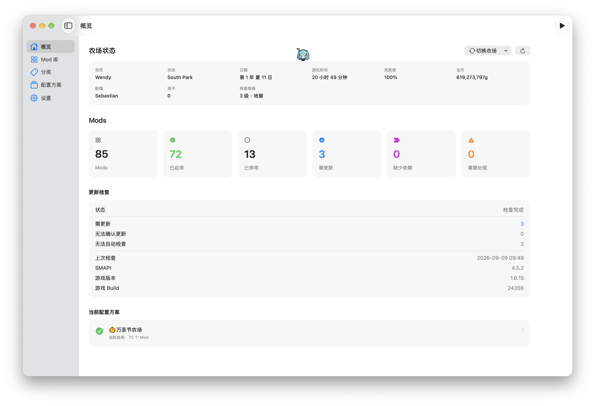

概览 —— 集中查看 Mod 状态、更新检查、当前配置方案以及 Stardew Valley 存档摘要。

## 当前支持与测试状态

当前正式构建的最低部署目标已经调整为 **macOS 15.0**。同一份应用代码面向 macOS 15.0 及更高版本维护，不再保留单独的“macOS 27 专用版”。

| 环境 | 当前状态 |
| --- | --- |
| **macOS 15.0** | 支持，核心功能可正常使用。当前虚拟机测试中，“分类”页面的首次进入和部分选择操作比新系统更慢，但不影响已确认的数据正确性与主要工作流。 |
| **macOS 26.0** | 已测试，主要界面与“分类”页面运行流畅。 |
| **macOS 27.0** | 已测试，主要界面与“分类”页面运行流畅。 |
| **Apple Silicon** | 原生 arm64 构建已实际测试。 |
| **Intel / x86_64** | 正式 Archive 包含 x86_64 slice；已在 Apple Silicon 上通过 Rosetta 2 验证 x86_64 可执行路径。尚未完成独立 Intel 实机回归测试。 |

> macOS 15.0 的性能结论来自当前虚拟机测试环境，不能等同于所有 macOS 15 实机的绝对性能基准。SVMM 不会仅为追求旧系统与新系统完全一致的动画/响应速度而维护另一套独立界面实现。

完整已知事项见 [KNOWN-ISSUES.md](KNOWN-ISSUES.md)。

## 核心功能

### Mod 库：卡片视图

用于快速浏览 Mod。可用时显示 Nexus 缩略图，并结合状态、名称备注等信息帮助识别 Mod。

  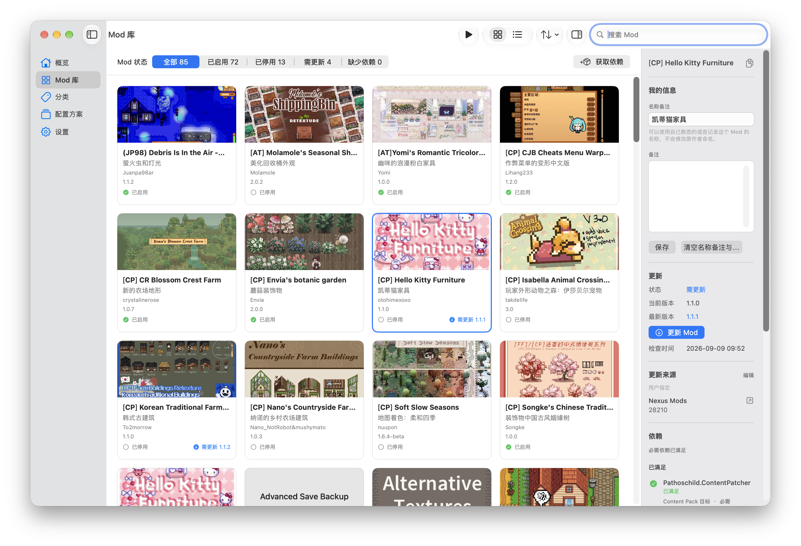

### Mod 库：列表视图

用于比较名称、备注名称、版本、类型、依赖、状态与安装时间等结构化信息，并支持排序与多选管理。

  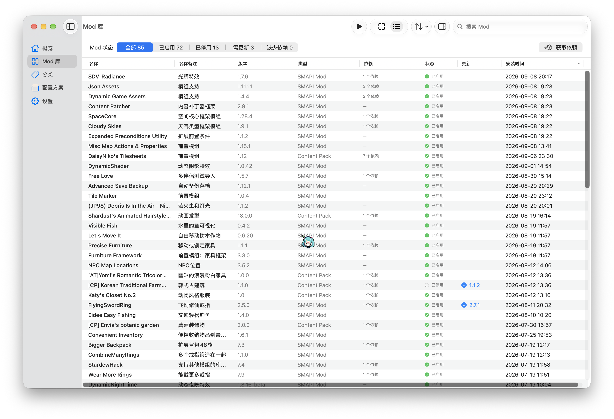

### Mod 名称备注：让本地管理更容易理解

许多 Stardew Valley Mod 使用英文、作者缩写或较长的项目名。SVMM 允许用户给 Mod 添加**名称备注**，例如把一个难以快速识别的英文 Mod 记为自己熟悉的中文名称。

名称备注：

- 只属于 SVMM 的本地管理数据；
- 不会修改 Mod 作者原始名称；
- 不会改写 `manifest.json`；
- 可用于 Mod 库与详细信息面板中的辅助识别；
- 可以和普通备注一起导入、导出及备份。

  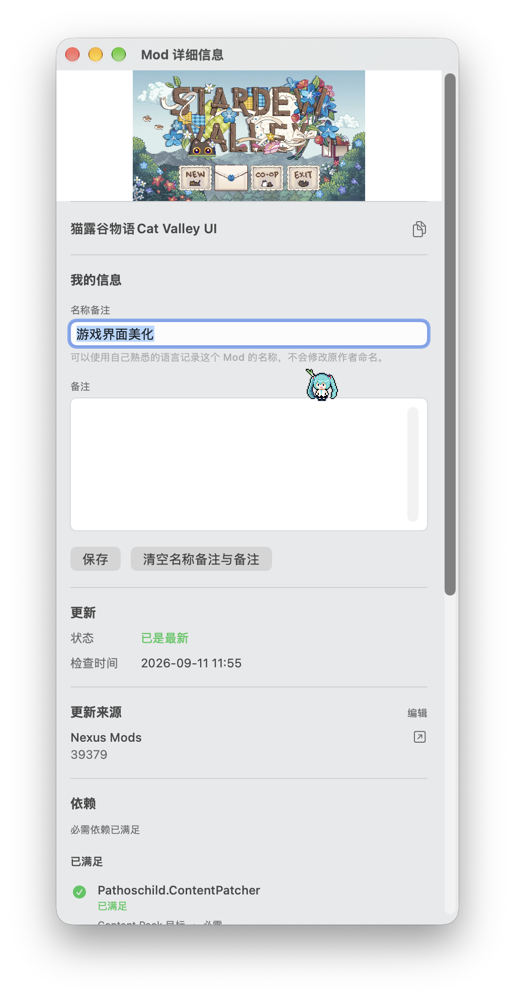

名称备注与详细信息面板 —— 用自己熟悉的语言记录 Mod 名称，同时保留作者原始名称，并集中查看缩略图、更新来源与依赖状态。

### Manifest 编辑：在应用内结构化修改 Mod 元数据

部分第三方 Mod 的 `manifest.json` 可能存在版本号、Unique ID、更新来源或依赖声明与实际发布内容不一致的情况。SVMM 提供内置 Manifest Editor，可以直接从 Mod 库或分类页面打开当前 Mod 的 `manifest.json`，以结构化表单进行修改。

当前编辑器支持：

- 修改 `Name`、`Author`、`Version`、`UniqueID` 与 `Description`；
- 修改 `EntryDll`、`MinimumApiVersion` 与 `MinimumGameVersion`；
- 编辑 `UpdateKeys`；
- 添加、删除或修改 `Dependencies`；
- 编辑 `ContentPackFor`；
- 在**结构化编辑**与**原始 JSON**之间切换；
- 保存前重新验证 JSON / Manifest 结构，保存后自动重新扫描 Mod；
- 结构化修改基于完整 JSON 对象写回，尽量保留与本次修改无关的未知字段。

  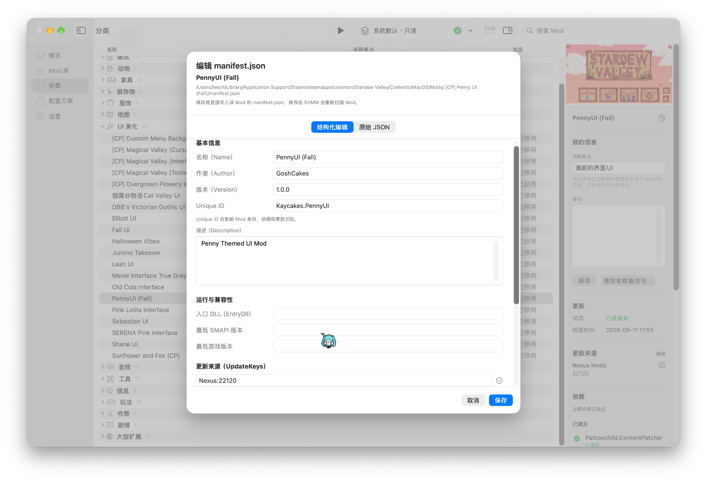

Manifest Editor —— 常用字段可以直接以结构化表单修改；需要时也可以切换到原始 JSON。

> 与“名称备注”和“用户更新来源覆盖”不同，Manifest Editor 会直接修改 Mod 自己的 `manifest.json`。

### 分类

分类负责“怎么整理”。系统默认分类方案提供只读参考，用户也可以创建自己的分类方案并调整 Mod 所属类目。

  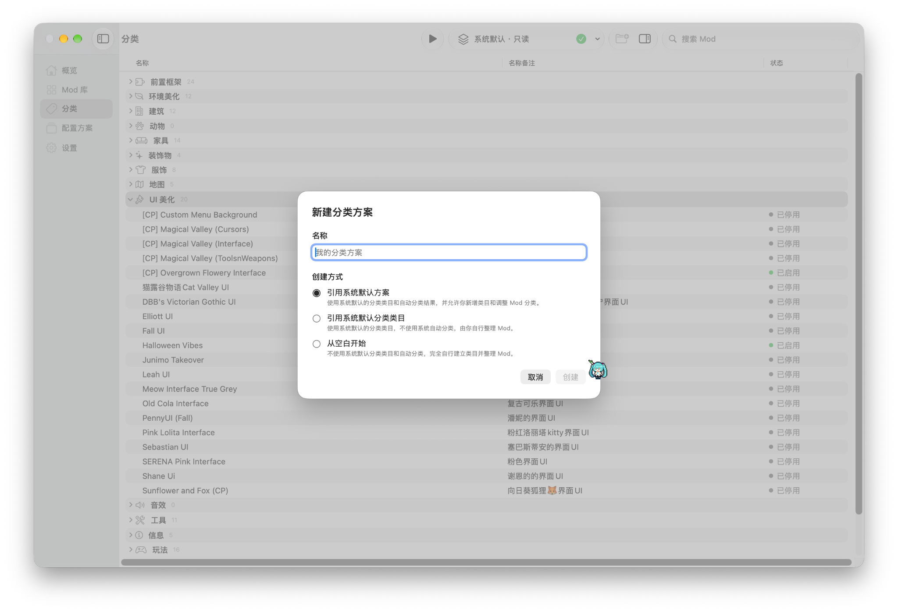

### 配置方案

配置方案负责“这次实际启用哪些 Mods”。可以保存不同的启用/停用组合，用于不同存档、玩法或测试环境之间切换。

  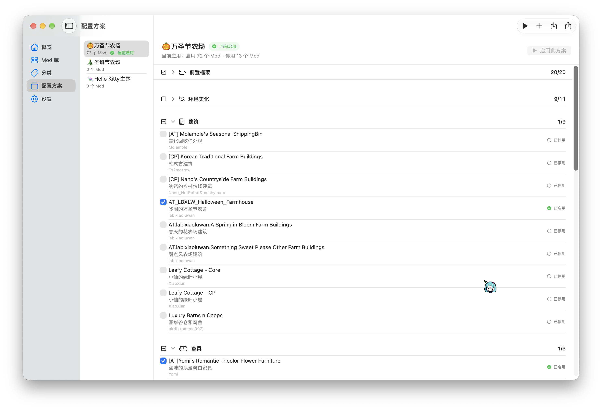

### 更新与 Nexus Mods

SVMM 可以结合 Mod 元数据、SMAPI 与可选的 Nexus Mods 连接，辅助检查和处理受支持的 Mod 更新。

Nexus Mods 连接不是使用本地管理功能的前提：

- **Free 账户**：通过浏览器 / NXM 授权继续受支持的下载与安装流程；
- **Premium 账户**：在符合条件时可以直接获取下载链接，并支持批量更新；
- 来源不明确、文件无法可靠判断或结构不受支持时，SVMM 会停止自动化而不是猜测。

#### Free 账户更新流程

  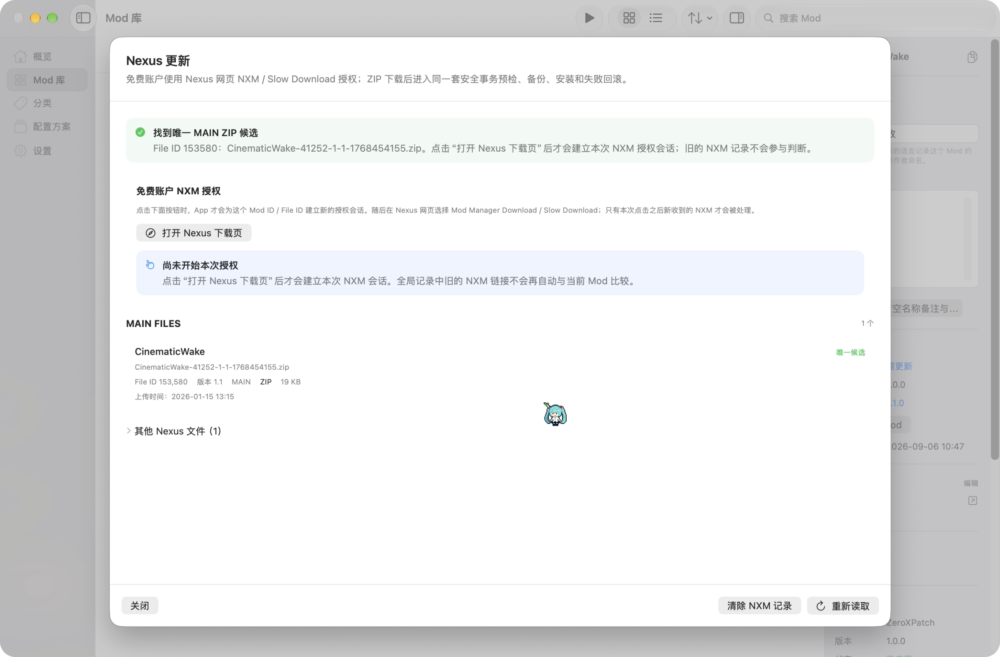

#### Premium 批量更新

  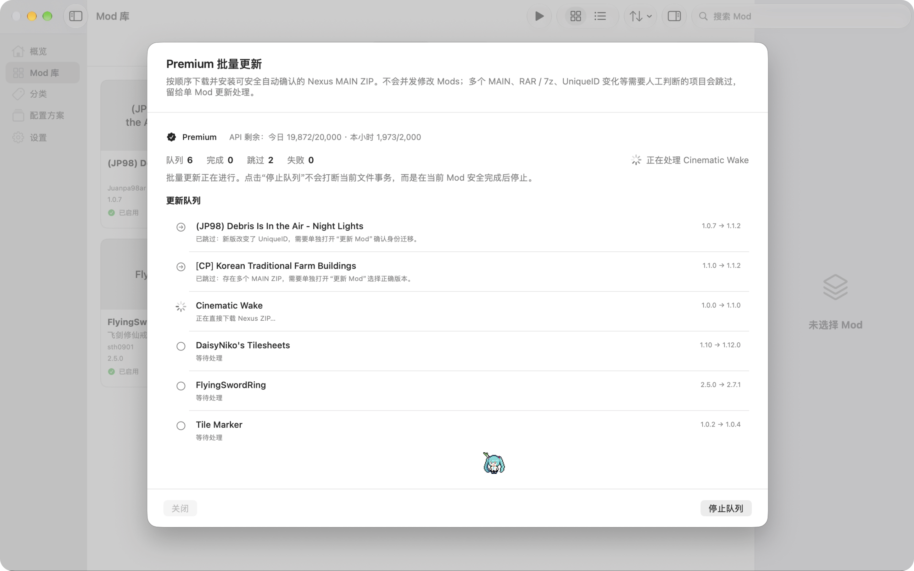

### 组合 Mod 更新包

部分作者会把两个或多个必须共同发布的 Mod 组件放在同一个 ZIP 中。SVMM 当前更新事务已经支持**经过验证的 bundled multi-Mod package**：

- 更新包可包含多个 `manifest.json`；
- 必须能够明确识别当前目标 Mod 以及同包组件；
- 已安装的同包组件可在同一事务中更新；
- 尚未安装、但属于同一受验证组合包的组件可随事务安装；
- 受支持的配置文件会尽可能保留；
- 任一关键步骤失败时，事务会尝试整体回滚，避免留下“只更新一半”的状态；
- 身份冲突、重复 Unique ID、路径冲突、降级风险或无法证明包结构安全时，自动更新会停止。

### 依赖获取

SVMM 会读取 Manifest 中的依赖声明，区分缺失、已停用、版本过低、版本未知和重复 Unique ID 等状态，并在来源可靠时提供获取入口。

#### Free 账户获取依赖

  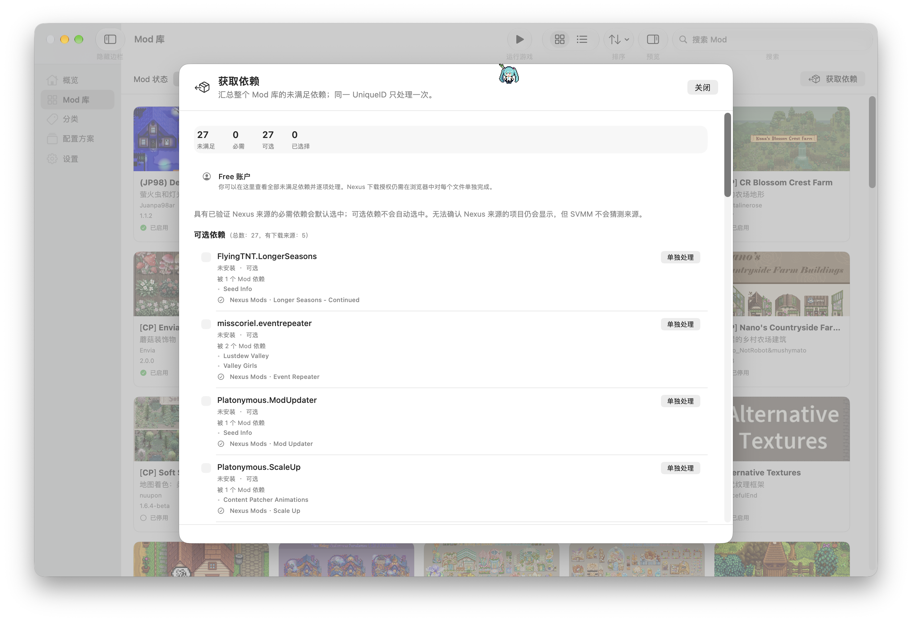

#### Premium 批量获取依赖

  

对于作者以多个必需组件共同打包的依赖 ZIP，SVMM 同样采用 bundled package 校验与单事务安装策略，而不是简单因为存在多个 `manifest.json` 就拒绝。

### 设置

设置页面集中管理游戏 / Mods 目录、界面语言、Nexus Mods 连接以及本地维护能力。

  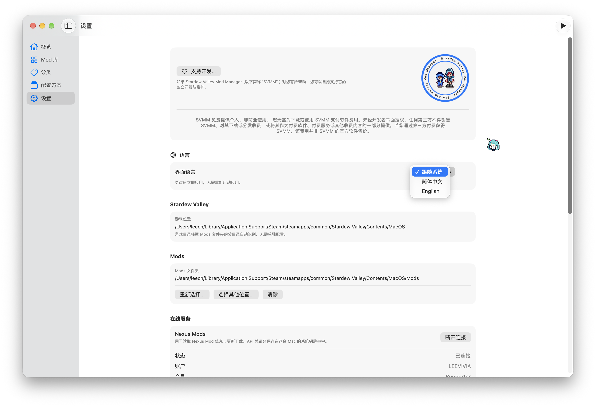

### 存储、缓存与数据备份

SVMM 提供面向本地数据的维护工具，用于控制缓存、临时事务数据以及用户自己的管理记录。

当前包括：

- 查看并清理 **Nexus 缩略图缓存**；
- 查看与清理 SVMM 管理的 **Mod 临时文件 / 更新事务残留**；
- 查看并清理已经卸载 Mod 留下的名称备注、普通备注、用户更新来源、分类或配置方案成员等管理记录；
- **导入 / 导出 Mod 备注数据**；
- **创建管理器数据备份**；
- **从备份恢复所选数据**。

这些功能针对的是 SVMM 自己管理的缓存和管理数据，不会把“清理缓存”解释为卸载正常 Mod。

  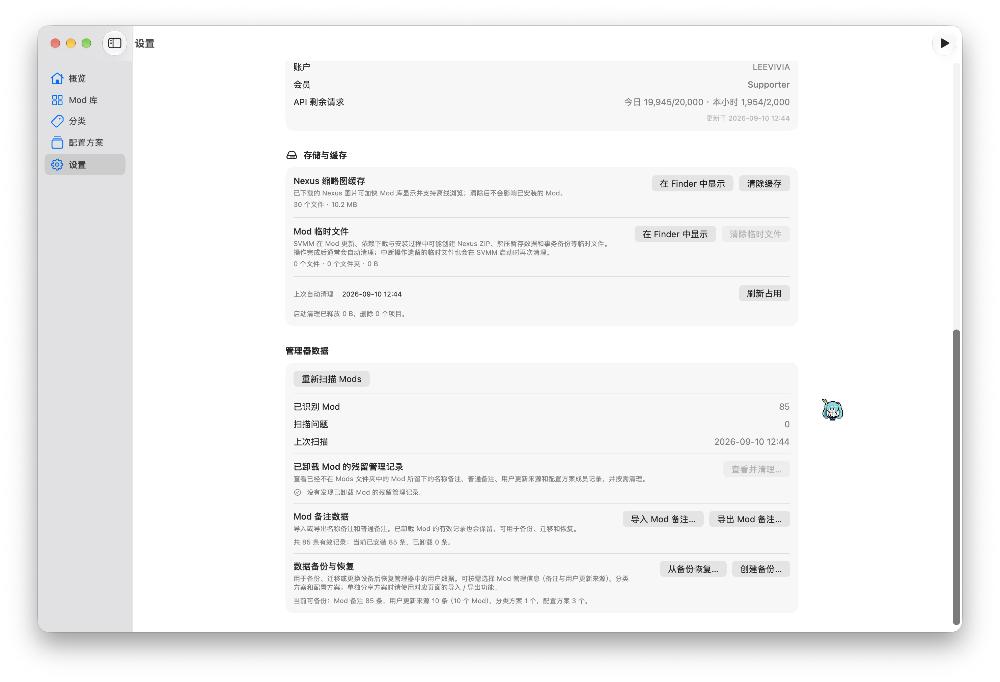

设置中的存储与管理器数据区域 —— 缓存清理、残留记录、备注导入导出以及数据备份/恢复集中管理。

## 界面语言与更多语言

SVMM 当前由开发者正式维护和审核的界面语言为：

1. **简体中文**
2. **English**
3. **跟随系统**

“跟随系统”并不是机器翻译。它表示让 macOS 在 **SVMM 已经提供的本地化资源**中选择最合适的语言。

SVMM 的界面文本已经采用本地化资源 / String Catalog 架构组织，设计上**保留继续增加其他语言的空间**。但是：

- 当前没有官方维护的第三种语言；
- 开发者不会把自己无法理解和审核的语言直接标记为“官方完整支持”；
- 对于开发者不具备语言能力的翻译，需要能够实际使用该语言的贡献者参与翻译、校对和版本更新审核；
- 如果希望协助增加其他语言，可通过 [GitHub Issues](https://github.com/XModLife/Stardew-Valley-Mod-Manager/issues) 或 **SVMM@npccare.cn** 联系开发者讨论协作方式。

修改界面语言后需要重新启动应用，确保 SwiftUI 内容与 macOS 原生菜单从启动阶段使用同一语言。

## 系统要求

- **最低系统：macOS 15.0**
- **构建架构：Universal 2（arm64 + x86_64）**
- Apple Silicon 为主要实际测试平台；
- x86_64 slice 已通过 Rosetta 2 启动验证，但 Intel 实机完整回归测试尚未完成；
- macOS 版 Stardew Valley；
- 正常 Mod 环境通常需要 SMAPI；
- 用户需要授权 SVMM 访问实际使用的 Stardew Valley / `Mods` 位置。

> `macOS 15.0+` 表示 15.0 是最低部署目标。未来尚未发布或尚未实际测试的 macOS 版本不能提前保证完全兼容。

## 下载

官方版本通过 **GitHub Releases** 发布：

### [下载最新官方版本 →](https://github.com/XModLife/Stardew-Valley-Mod-Manager/releases/latest)

为避免获得被修改或倒卖的软件，请只从开发者明确指定的官方分发渠道获取 SVMM。**不要向第三方支付 SVMM 应用本身的购买费用。**

## macOS 安全提示

SVMM v1.0.0 通过 GitHub 独立分发。当前发布包**未使用 Apple Developer ID 证书签名，也未经过 Apple Notarization（公证）**。

因此，从互联网下载后首次启动时，macOS Gatekeeper 可能提示无法验证开发者或无法检查该 App 是否包含恶意软件。

请只从本仓库官方 GitHub Release 下载，并核对 Release 页面提供的 SHA-256。确认来源后，如 macOS 阻止首次启动，可先尝试打开一次，然后前往：

**系统设置 → 隐私与安全性 → 安全性 → 仍要打开（Open Anyway）**

## 首次使用

1. 从官方 GitHub Releases 下载 SVMM。
2. 按照 macOS 安全提示完成首次启动。
3. 在“设置”中选择实际使用的 Stardew Valley / Mods 位置。
4. 授权 SVMM 扫描 Mods 文件夹。
5. 先查看“概览”和“扫描诊断”，确认当前环境。
6. 如需要 Nexus 元数据、缩略图或受支持的下载工作流，再选择连接 Nexus Mods。
7. 在进行大型更新或配置调整前，建议创建独立备份。

## 当前版本说明与已知问题

SVMM 1.0.0 是首次公开发行版本。当前已经确认的主要环境差异与边界包括：

- **macOS 15.0 分类页面响应速度较新系统慢**：在当前虚拟机测试中，首次进入分类以及部分行选择操作存在更明显延迟；功能可用，未发现因此导致的数据损坏。macOS 26.0 与 macOS 27.0 测试流畅。
- **macOS beta / seed 的“帮助”菜单可能短暂变化**：系统可能动态注入 Feedback Assistant 项目，这是 macOS 行为，不影响 SVMM 核心数据。
- **非标准第三方 Mod 包仍可能需要人工判断**：SVMM 会尽量验证 Manifest、Unique ID、依赖与文件结构，但不会对无法可靠证明安全的包进行猜测式安装。
- **第三方服务可能变化**：Nexus Mods、SMAPI、GitHub 或相关 CDN/API 的变化可能影响可选在线功能。
- **Intel 实机验证有限**：Universal 2 构建包含 x86_64，但目前主要测试集中于 Apple Silicon；欢迎 Intel 用户提供可复现的兼容性反馈。

完整列表参阅 [KNOWN-ISSUES.md](KNOWN-ISSUES.md)。

## 用户文档

- [使用手册](USER-GUIDE.md) · [User Manual](USER-GUIDE.en.md)
- [已知问题](KNOWN-ISSUES.md)
- [常见问题](FAQ.md)
- [支持与问题反馈](SUPPORT.md)
- [安全政策](SECURITY.md)
- [隐私政策](PRIVACY.md) · [Privacy Policy](PRIVACY.en.md)
- [软件许可协议](SOFTWARE-LICENSE.md) · [Software License Agreement](SOFTWARE-LICENSE.en.md)
- [更新记录](CHANGELOG.md)

## 隐私

SVMM 采用**本地优先（Local-first）**模式。

当前版本不提供 SVMM 用户账户系统，不包含广告系统、用户行为分析 SDK 或遥测后台，也不运营用于接收用户 Mods、存档或 SVMM 管理数据库的开发者服务器。

部分可选功能会直接访问 SMAPI、Nexus Mods、GitHub 及相关下载基础设施。Nexus API 凭据保存在 macOS 钥匙串（Keychain）中。

完整内容请参阅 [隐私政策](PRIVACY.md)。

## 软件许可与分发

SVMM 是**闭源、专有软件**，当前免费提供给用户用于**个人、非商业用途**。

在 GitHub 公开发布安装版本与用户文档，并不意味着 SVMM 转为开源软件，也不授予超出 [软件许可协议](SOFTWARE-LICENSE.md) 范围的源代码、再分发、修改或商业使用权利。

应用可能展示开发者的个人支付宝收款码，用于用户自愿支持独立开发。支持完全可选，不会解锁功能、不会形成订阅，也不会获得额外软件许可权利。

## 问题反馈与支持

普通 Bug、兼容性问题、文档错误和明确的功能建议请使用 [GitHub Issues](https://github.com/XModLife/Stardew-Valley-Mod-Manager/issues)。

涉及性能或兼容性时，请同时说明：

- SVMM 版本；
- macOS 版本；
- Mac 芯片 / 架构；
- 物理 Mac 还是虚拟机；
- Stardew Valley 与 SMAPI 版本（如相关）。

提交前请删除或遮盖 Nexus API Key、密码、Token、支付凭据以及不希望公开的本机用户名、文件路径等信息。

安全漏洞请按照 [SECURITY.md](SECURITY.md) 私下报告。

## 第三方项目与商标

SVMM 为独立开发项目。

Stardew Valley、ConcernedApe 相关内容、SMAPI、Nexus Mods、第三方 Mods、GitHub 以及其他第三方名称、软件、服务、商标与内容，均归其各自合法权利人所有。

除非相关权利人另有明确书面说明，SVMM **不隶属于上述第三方，不代表其官方，不是其代理，也未获得其赞助或背书**。

## 联系方式

**开发者：** 李薇（Li Wei）  
**邮箱：** SVMM@npccare.cn
